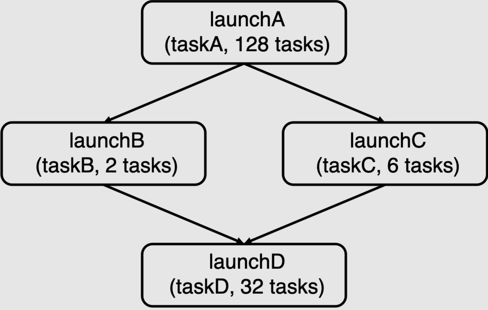

# Assignment 2: Building A Task Execution Library from the Ground Up #

**Due Mon Oct 24, 11:59pm**

**100 points total**

## Overview ##

Everyone likes to complete tasks quickly, and in this assignment we are asking you to do just that! You will implement a C++ library that executes tasks provided by an application as efficiently as possible on a multi-core CPU.

In the first part of the assignment, you will implement a version of the task execution library that supports bulk (data-parallel) launch of many instances of the same task. This functionality is similar to the [ISPC task launch behavior](http://ispc.github.io/ispc.html#task-parallelism-launch-and-sync-statements) you used to parallelize code across cores in Assignment 1.

In the second part of the assignment, you will extend your task runtime system to execute more complex _task graphs_, where the execution of tasks may depend on the results produced by other tasks. These dependencies constrain which tasks can be safely run in parallel by your task scheduling system.  Scheduling execution of data-parallel task graphs on a parallel machine is a feature of many popular parallel runtime systems ranging from the popular [Thread Building Blocks](https://github.com/intel/tbb) library, to [Apache Spark](https://spark.apache.org/), to modern deep learning frameworks such as [PyTorch](https://pytorch.org/) and [TensorFlow](https://www.tensorflow.org/).

This assignment will require you to:

* Manage task execution using a thread pool
* Orchestrate worker thread execution using synchronization primitives such as mutexes and condition variables
* Implement a task scheduler that reflects dependencies defined by a task graph
* Understand workload characteristics to make efficient task scheduling decisions

### Wait, I Think I've Done This Before? ###

You may have already created thread pools and task execution libraries in classes such as CS110.
However, the current assignment is a unique opportunity to better understand these systems.
You will implement multiple task execution libraries, some without thread pools and some with different types of thread pools.
By implementing multiple task scheduling strategies and comparing their performance on difference workloads, you will better understand the implications of key design choices when creating a parallel system.

## Environment Setup ##

**We will be grading this assignment on an Amazon AWS `m6i.2xlarge` instance - we provide instructions for setting up your VM [here](https://github.com/stanford-cs149/asst2/blob/master/cloud_readme.md). Please ensure your code works on this VM as we will be using this for performance testing and grading.**

The assignment starter code is available on [Github](https://github.com/stanford-cs149/asst2). Please clone the Assignment 2 starter code using:

    git clone https://github.com/stanford-cs149/asst2.git

## Part A: Synchronous Bulk Task Launch

In Assignment 1, you used ISPC's task launch primitive to launch N instances of an ISPC task (`launch[N] myISPCFunction()`).  In the first part of this assignment, you will implement similar functionality in your task execution library.

To get started, get acquainted with the definition of `ITaskSystem` in `itasksys.h`. This [abstract class](https://www.tutorialspoint.com/cplusplus/cpp_interfaces.htm) defines the interface to your task execution system.  The interface features a method `run()`, which has the following signature:

    virtual void run(IRunnable* runnable, int num_total_tasks) = 0;

`run()` executes `num_total_tasks` instances of the specified task.  Since this single function call results in the execution of many tasks, we refer to each call to `run()` as a _bulk task launch_.

The starter code in `tasksys.cpp` contains a correct, but serial, implementation of `TaskSystemSerial::run()` which serves as an example of how the task system uses the `IRunnable` interface to execute a bulk task launch. (The definition of `IRunnable` is in `itasksys.h`) Notice how in each call to `IRunnable::runTask()` the task system provides the task a current task identifier (an integer between 0 and `num_total_tasks`), as well as the total number of tasks in the bulk task launch.  The task's implementation will use these parameters to determine what work the task should do.

One important detail of `run()` is that it must execute tasks synchronously with respect to the calling thread.  In other words, when the call to `run()` returns, the application is guaranteed that the task system has completed execution of ****all tasks**** in the bulk task launch.  The serial implementation of `run()` provided in the starter code executes all tasks on the calling thread and thus meets this requirement.

### Running Tests ###

The starter code contains a suite of test applications that use your task system. For a description of the test harness tests, see `tests/README.md`, and for the test definitions themselves, see `tests/tests.h`. To run a test, use the `runtasks` script. For example, to run the test called `mandelbrot_chunked`, which computes an image of a Mandelbrot fractal using a bulk launch of tasks that each process a continuous chunk of the image, type:

```bash
./runtasks -n 8 mandelbrot_chunked
```


The different tests have different performance characteristics -- some do little work per task, others perform significant amounts of processing.  Some tests create large numbers of tasks per launch, others very few.  Sometimes the tasks in a launch all have similar compute cost.  In others, the cost of tasks in a single bulk launch is variable. We have described most of the tests in `tests/README.md`, but we encourage you to inspect the code in `tests/tests.h` to understand the behavior of all tests in more detail.

One test that may be helpful to debug correctness while implementing your solution is `simple_test_sync`, which is a very small test that should not be used to measure performance but is small enough to be debuggable with print statements or debugger. See function `simpleTest` in `tests/tests.h`.

We encourage you to create your own tests. Take a look at the existing tests in `tests/tests.h` for inspiration. We have also included a skeleton test composed of `class YourTask` and function `yourTest()` for you to build on if you so choose. For the tests you do create, make sure to add them to the list of tests and test names in `tests/main.cpp`, and adjust the variable `n_tests` accordingly. Please note that while you will be able to run your own tests with your solution, you will not be able to compile the reference solution to run your tests.

The `-n` command-line option specifies the maximum number of threads the task system implementation can use.  In the example above, we chose `-n 8` because the CPU in the AWS instance features eight execution contents.  The full list of tests available to run is available via command line help  (`-h` command line option).

The `-i` command-line options specifies the number of times to run the tests during performance measurement. To get an accurate measure of performance, `./runtasks` runs the test multiple times and records the _minimum_ runtime of several runs; In general, the default value is sufficient---Larger values might yield more accurate measurements, at the cost of greater test runtime.

In addition, we also provide you the test harness that we will use for grading performance:

```bash
>>> python ../tests/run_test_harness.py
```

The harness has the following command line arguments,

```bash
>>> python run_test_harness.py -h
usage: run_test_harness.py [-h] [-n NUM_THREADS]
                           [-t TEST_NAMES [TEST_NAMES ...]] [-a]

Run task system performance tests

optional arguments:
  -h, --help            show this help message and exit
  -n NUM_THREADS, --num_threads NUM_THREADS
                        Max number of threads that the task system can use. (8
                        by default)
  -t TEST_NAMES [TEST_NAMES ...], --test_names TEST_NAMES [TEST_NAMES ...]
                        List of tests to run
  -a, --run_async       Run async tests
```

It produces a detailed performance report that looks like this:

```bash
>>> python ../tests/run_test_harness.py -t super_light super_super_light
python ../tests/run_test_harness.py -t super_light super_super_light
================================================================================
Running task system grading harness... (2 total tests)
  - Detected CPU with 8 execution contexts
  - Task system configured to use at most 8 threads
================================================================================
================================================================================
Executing test: super_super_light...
Reference binary: ./runtasks_ref_linux
Results for: super_super_light
                                        STUDENT   REFERENCE   PERF?
[Serial]                                9.053     9.022       1.00  (OK)
[Parallel + Always Spawn]               8.982     33.953      0.26  (OK)
[Parallel + Thread Pool + Spin]         8.942     12.095      0.74  (OK)
[Parallel + Thread Pool + Sleep]        8.97      8.849       1.01  (OK)
================================================================================
Executing test: super_light...
Reference binary: ./runtasks_ref_linux
Results for: super_light
                                        STUDENT   REFERENCE   PERF?
[Serial]                                68.525    68.03       1.01  (OK)
[Parallel + Always Spawn]               68.178    40.677      1.68  (NOT OK)
[Parallel + Thread Pool + Spin]         67.676    25.244      2.68  (NOT OK)
[Parallel + Thread Pool + Sleep]        68.464    20.588      3.33  (NOT OK)
================================================================================
Overall performance results
[Serial]                                : All passed Perf
[Parallel + Always Spawn]               : Perf did not pass all tests
[Parallel + Thread Pool + Spin]         : Perf did not pass all tests
[Parallel + Thread Pool + Sleep]        : Perf did not pass all tests
```

In the above output `PERF` is the ratio of your implementation's runtime to the reference solution's runtime. So values less than one indicate that your task system implementation is faster than the reference implementation.

__Mac users: While we provided reference solution binaries for both part a and part b, we will be testing your code using the linux binaries. Therefore, we recommend you check your implementation in the AWS instance before submitting. If you are using a newer Mac with an M1 chip, use the `runtasks_ref_osx_arm` binary when testing locally. Otherwise, use the `runtasks_ref_osx_x86` binary.__

### What You Need To Do ###

Your job is to implement a task execution engine that efficiently uses your multi-core CPU. You will be graded on both the correctness of your implementation (it must run all the tasks correctly) as well as on its performance.  This should be a fun coding challenge, but it is a non-trivial piece of work. To help you stay on the right track, to complete Part A of the assignment, we will have you implement multiple versions of the task system, slowly increasing in complexity and performance of your implementation.  Your three implementations will be in the classes defined in `tasksys.cpp/.h`.

* `TaskSystemParallelSpawn`
* `TaskSystemParallelThreadPoolSpinning`
* `TaskSystemParallelThreadPoolSleeping`

__Implement your part A implementation in the `part_a/` sub-directory to compare to the correct reference implementation (`part_a/runtasks_ref_*`).__

_Pro tip: Notice how the instructions below take the approach of "try the simplest improvement first". Each step increases the complexity of the task execution system's implementation, but on each step along the way you should have a working (fully correct) task runtime system._

We also expect you to create at least one test, which can test either correctness or performance. See the Running Tests section above for more information.

#### Step 1: Move to a Parallel Task System ####

__In this step please implement the class `TaskSystemParallelSpawn`.__

The starter code provides you a working serial implementation of the task system in `TaskSystemSerial`.  In this step of the assignment you will extend the starter code to execute a bulk task launch in parallel.

* You will need to create additional threads of control to perform the work of a bulk task launch.  Notice that `TaskSystem`'s constructor is provided a parameter `num_threads` which is the ****maximum number of worker threads**** your implementation may use to run tasks.

* In the spirit of "do the simplest thing first", we recommend that you spawn worker threads at the beginning of `run()` and join these threads from the main thread before `run()` returns.  This will be a correct implementation, but it will incur significant overhead from frequent thread creation.

* How will you assign tasks to your worker threads?  Should you consider static or dynamic assignment of tasks to threads?

* Are there shared variables (internal state of your task execution system) that you need to protect from simultaneous access from multiple threads?  You may wish to review our [C++ synchronization tutorial](tutorial/README.md) for more information on the synchronization primitives in the C++ standard library.

#### Step 2: Avoid Frequent Thread Creation Using a Thread Pool ####

__In this step please implement the class `TaskSystemParallelThreadPoolSpinning`.__

Your implementation in step 1 will incur overhead due to creating threads in each call to `run()`.  This overhead is particularly noticeable when tasks are cheap to compute.  At this point, we recommend you move to a "thread pool" implementation where your task execution system creates all worker threads up front (e.g., during `TaskSystem` construction, or upon the first call to `run()`).

* As a starting implementation we recommend that you design your worker threads to continuously loop, always checking if there is more work to them to perform. (A thread entering a while loop until a condition is true is typically referred to as "spinning".)  How might a worker thread determine there is work to do?

* It is now non-trivial to ensure that `run()` implements the required synchronous behavior.  How do you need to change the implementation of `run()` to determine that all tasks in the bulk task launch have completed?

#### Step 3: Put Threads to Sleep When There is Nothing to Do ####

__In this step please implement the class `TaskSystemParallelThreadPoolSleeping`.__

One of the drawbacks of the step 2 implementation is that threads utilize a CPU core's execution resources as they "spin" waiting for something to do.  For example, worker threads might loop waiting for new tasks to arrive.  As another example, the main thread might loop waiting for the worker threads to complete all tasks so it can return from a call to `run()`.  This can hurt performance since CPU resources are used to run these threads even though the threads are not doing useful work.

In this part of the assignment, we want you to improve the efficiency of your task system by putting threads to sleep until the condition they are waiting for is met.

* Your implementation may choose to use condition variables to implement this behavior.  Condition variables are a synchronization primitive that enables threads to sleep (and occupy no CPU processing resources) while they are waiting for a condition to exist. Other threads "signal" waiting threads to wake up to see if the condition they were waiting for has been met. For example, your worker threads could be put to sleep if there is no work to be done (so they don't take CPU resources away from threads trying to do useful work).  As another example, your main application thread that calls `run()` might want to sleep while it waits for all the tasks in a bulk task launch to be completed by the worker threads. (Otherwise a spinning main thread would take CPU resources away from the worker threads!)  Please see our [C++ synchronization tutorial](tutorial/README.md) for more information on condition variables in C++.

* Your implementation in this part of the assignment may have tricky race conditions to think about.  You'll need to consider many possible interleavings of thread behavior.

* You might want to consider writing additional test cases to exercise your system.  __The assignment starter code includes the workloads that the grading script will use to grade the performance of your code, but we will also test the correctness of your implementation using a wider set of workloads that we are not providing in the starter code!__

## Part B: Supporting Execution of Task Graphs

In part B of the assignment you will extend your part A task system implementation to support the asynchronous launch of tasks that may have dependencies on previous tasks.  These inter-task dependencies create scheduling constraints that your task execution library must respect.

The `ITaskSystem` interface has an additional method:

    virtual TaskID runAsyncWithDeps(IRunnable* runnable, int num_total_tasks,
                                    const std::vector<TaskID>& deps) = 0;

`runAsyncWithDeps()` is similar to `run()` in that it also is used to perform a bulk launch of `num_total_tasks` tasks. However, it differs from `run()` in a number of ways...

#### Asynchronous Task Launch ####

First, tasks created using `runAsyncWithDeps()` are executed by the task system _asynchronously_ with the calling thread. This means that `runAsyncWithDeps()`, should return to the caller _immediately_, even if the tasks have not completed execution. The method returns a unique identifier associated with this bulk task launch.

The calling thread can determine when the bulk task launch has actually completed by calling `sync()`.

    virtual void sync() = 0;

`sync()` returns to the caller __only when the tasks associated with all prior bulk task launches have completed.__  For example, consider the following code:

    // assume taskA and taskB are valid instances of IRunnable...

    std::vector<TaskID> noDeps;  // empty vector

    ITaskSystem *t = new TaskSystem(num_threads);

    // bulk launch of 4 tasks
    TaskID launchA = t->runAsyncWithDeps(taskA, 4, noDeps);

    // bulk launch of 8 tasks
    TaskID launchB = t->runAsyncWithDeps(taskB, 8, noDeps);

    // at this point tasks associated with launchA and launchB
    // may still be running

    t->sync();

    // at this point all 12 tasks associated with launchA and launchB
    // are guaranteed to have terminated

As described in the comments above, the calling thread is not guaranteed tasks from previous calls to `runAsyncWithDeps()` have completed until the thread calls `sync()`.  To be precise, `runAsyncWithDeps()` tells your task system to perform a new bulk task launch, but your implementation has the flexibility to execute these tasks at any time prior to the next call to `sync()`.  Note that this specification means there is no guarantee that your implementation performs tasks from launchA prior to starting tasks from launchB!

#### Support for Explicit Dependencies ####

The second key detail of `runAsyncWithDeps()` is its third argument: a vector of TaskID identifiers that must refer to previous bulk task launches using `runAsyncWithDeps()`.  This vector specifies what prior tasks the tasks in the current bulk task launch depend on. __Therefore, your task runtime cannot begin execution of any task in the current bulk task launch until all tasks from the launches given in the dependency vector are complete!__  For example, consider the following example:

    std::vector<TaskID> noDeps;  // empty vector
    std::vector<TaskID> depOnA;
    std::vector<TaskID> depOnBC;

    ITaskSystem *t = new TaskSystem(num_threads);

    TaskID launchA = t->runAsyncWithDeps(taskA, 128, noDeps);
    depOnA.push_back(launchA);

    TaskID launchB = t->runAsyncWithDeps(taskB, 2, depOnA);
    TaskID launchC = t->runAsyncWithDeps(taskC, 6, depOnA);
    depOnBC.push_back(launchB);
    depOnBC.push_back(launchC);

    TaskID launchD = t->runAsyncWithDeps(taskD, 32, depOnBC);
    t->sync();

The code above features four bulk task launches (taskA: 128 tasks, taskB: 2 tasks, taskC: 6 tasks, taskD: 32 tasks).  Notice that the launch of taskB and of taskC depend on taskA. The bulk launch of taskD (`launchD`) depends on the results of both `launchB` and `launchC`.  Therefore, while your task runtime is allowed to process tasks associated with `launchB` and `launchC` in any order (including in parallel), all tasks from these launches must begin executing after the completion of tasks from `launchA`, and they must complete before your runtime can begin executing any task from `launchD`.

We can illustrate these dependencies visually as a __task graph__. A task graph is a directed acyclic graph (DAG), where nodes in the graph correspond to bulk task launches, and an edge from node X to node Y indicates a dependency of Y on the output of X.  The task graph for the code above is:

<p align="center">
    
</p>

Notice that if you were running the example above on a Myth machine with eight execution contexts, the ability to schedule the tasks from `launchB` and `launchC` in parallel might be quite useful, since neither bulk task launch on its own is sufficient to use all the execution resources of the machine.

### Testing ###
All of the tests with postfix `Async` should be used to test part B. The subset of tests included in the grading harness are described in `tests/README.md`, and all tests can be found in `tests/tests.h` and are listed in `tests/main.cpp`. To debug correctness, we've provided a small test `simple_test_async`. Take a look at the `simpleTest` function in `tests/tests.h`. `simple_test_async` should be small enough to debug using print statements or breakpoints inside `simpleTest`.

We encourage you to create your own tests. Take a look at the existing tests in `tests/tests.h` for inspiration. We have also included a skeleton test composed of `class YourTask` and function `yourTest()` for you to build on if you so choose. For the tests you do create, make sure to add them to the list of tests and test names in `tests/main.cpp`, and adjust the variable `n_tests` accordingly. Please note that while you will be able to run your own tests with your solution, you will not be able to compile the reference solution to run your tests.

### What You Need to Do ###

You must extend your task system implementation that uses a thread pool (and sleeps) from part A to correctly implement `TaskSystemParallelThreadPoolSleeping::runAsyncWithDeps()` and `TaskSystemParallelThreadPoolSleeping::sync()`. We also expect you to create at least one test, which can test either correctness or performance. See the Testing section above for more information.
**You do not need to implement the other `TaskSystem` classes in Part B.**

As with Part A, we offer you the following tips to get started:
* It may be helpful to think about the behavior of `runAsyncWithDeps()` as pushing a record corresponding to the bulk task launch, or perhaps records corresponding to each of the tasks in the bulk task launch onto a "work queue".  Once the record to work to do is in the queue, `runAsyncWithDeps()` can return to the caller.

* The trick in this part of the assignment is performing the appropriate bookkeeping to track dependencies. What must be done when all the tasks in a bulk task launch complete? (This is the point when new tasks may become available to run.)

* It can be helpful to have two data structures in your implementation: (1) a structure representing tasks that have been added to the system via a call to `runAsyncWithDeps()`, but are not yet ready to execute because they depend on tasks that are still running (these tasks are "waiting" for others to finish) and (2) a "ready queue" of tasks that are not waiting on any prior tasks to finish and can safely be run as soon as a worker thread is available to process them.

* You need not worry about integer wrap around when generating unique task launch ids. We will not hit your task system with over 2^31 bulk task launches.

* You can assume all programs will either call only `run()` or only `runAsyncWithDeps()`; that is, you do not need to handle the case where a `run()` call needs to wait for all proceeding calls to `runAsyncWithDeps()` to finish. Note that this assumption means you can implement `run()` using appropriate calls to `runAsyncWithDeps()` and `sync()`.

__Implement your part B implementation in the `part_b/` sub-directory to compare to the correct reference implementation (`part_b/runtasks_ref_*`).__

## Grading ##

Points in this assignment will be assigned as follows,

**Part A (50 points)**
- 5 points for correctness of `TaskSystemParallelSpawn::run()` + 5 points for its performance.  (10 points total)
- 10 points each for correctness `TaskSystemParallelThreadPoolSpinning::run()` and `TaskSystemParallelThreadPoolSleeping::run()` + 10 points each for the performance of these methods. (40 points total)

**Part B (40 points)**
- 30 points for correctness of `TaskSystemParallelThreadPoolSleeping::runAsyncWithDeps()`, `TaskSystemParallelThreadPoolSleeping::run()`, and `TaskSystemParallelThreadPoolSleeping::sync()`
- 10 points for performance of `TaskSystemParallelThreadPoolSleeping::runAsyncWithDeps()`, `TaskSystemParallelThreadPoolSleeping::run()`, and `TaskSystemParallelThreadPoolSleeping::sync()`

**Writeup (10 points)**

For each test, full performance points will be awarded for implementations within 20% of the provided reference implementation. Performance points are only awarded for implementations that return correct answers. As stated before, we may also test the _correctness_ of your implementation using a wider set of workloads that we are not providing in the starter code.

## Handin ##

Please submit your work using [Gradescope](https://www.gradescope.com/).  Your submission should include both your task system code, and a writeup describing your implementation.  We are expecting the following five files in the handin:

 * part_a/tasksys.cpp
 * part_a/tasksys.h
 * part_b/tasksys.cpp
 * part_b/tasksys.h
 * writeup.pdf

#### Code Handin ####

We ask you to submit source files `part_a/tasksys.cpp|.h` and `part_b/tasksys.cpp|.h`. You can create a directory (e.g named `asst2_submission`) with sub-directories `part_a` and `part_b`, drop the relevant files in, compress the directory by running `tar -czvf asst2.tar.gz asst2_submission`, and upload it. Please submit the compressed file to assignment *Programming Assignment 2 (Code Submission)* on Gradescope.

Before submitting the source files, make sure that all code is compilable and runnable! We should be able to drop these files into a clean starter code tree, type `make`, and then execute your program without manual intervention.

Our grading scripts will run the checker code provided to you in the starter code to determine performance points.  _We will also run your code on other applications that are not provided in the starter code to further test its correctness!_

#### Writeup Handin ####

Please submit a brief writeup to the assignment *Programming Assignment 2 (Writeup Submission)* on Gradescope, addressing the following:

 1. Describe your task system implementation (1 page is fine).  In additional to a general description of how it works, please make sure you address the following questions:
  * How did you decide to manage threads? (e.g., did you implement a thread pool?)
  * How does your system assign tasks to worker threads? Did you use static or dynamic assignment?
  * How did you track dependencies in Part B to ensure correct execution of task graphs?

 2. In Part A, you may have noticed that simpler task system implementations (e.g., a completely serial implementation, or the spawn threads every launch implementation), perform as well as or sometimes better than the more advanced implementations.  Please explain why this is the case, citing certain tests as examples.  For example, in what situations did the sequential task system implementation perform best? Why?  In what situations did the spawn-every-launch implementation perform as well as the more advanced parallel implementations that use a thread pool?  When does it not?
 3. Describe one test that you implemented for this assignment. What does the test do, what is it meant to check, and how did you verify that your solution to the assignment did well on your test? Did the result of the test you added cause you to change your assignment implementation?
